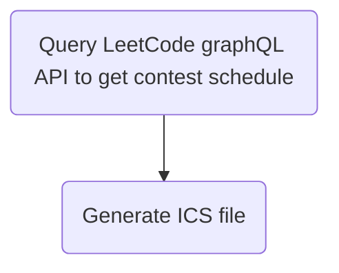
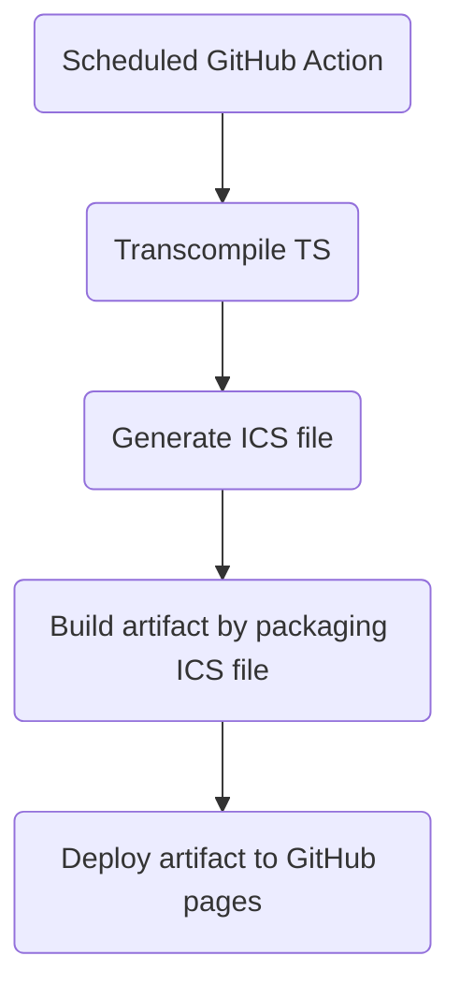

# leetcode-contest-calendar

This repository generates LeetCode contest calendar in ICS format daily and deploys to GitHub pages for external subscription.

## Usage

Include following URL in calendar apps to subscribe recent LeetCode contest.
[https://zerogazer.github.io/leetcode-contest-calendar/leetcode-contest-calendar.ics](https://zerogazer.github.io/leetcode-contest-calendar/leetcode-contest-calendar.ics)

## Development

Node v20
Yarn v5

## Design

### Calendar properties
* Recent 10 contests
* Trigger alarm before 30 minutes
* Event is a free event

### File generation

### File deploment

## License

[MIT](https://choosealicense.com/licenses/mit/)
